# Proyecto (**DOOM Arcade** )

**Los creadores de este juego son *Omar Jesus Zabala* y *Jayden Hammond*.**
#  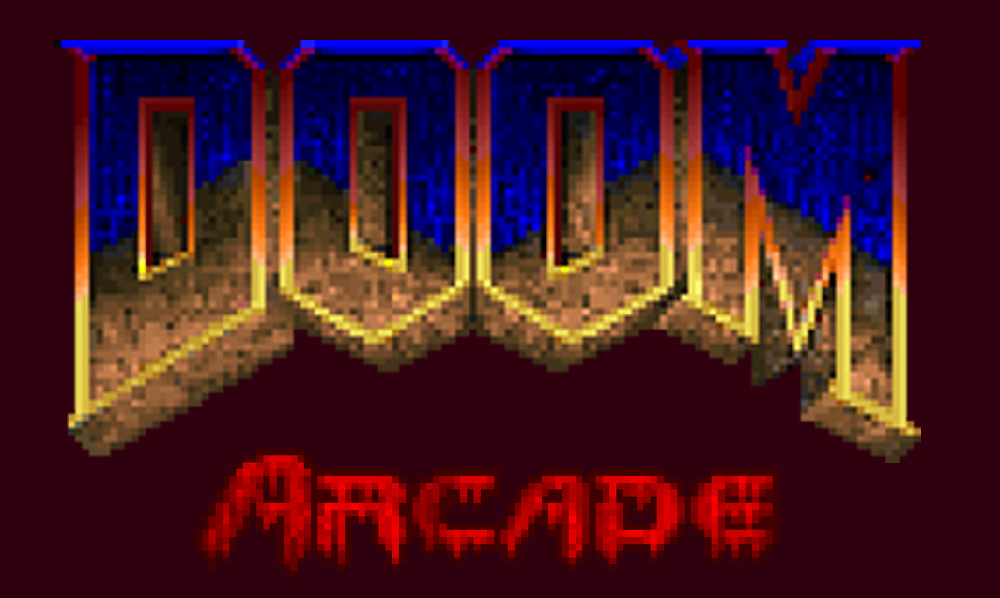

1. [Descripción](#descripción)
2. [Controles](#controles)
3. [Características](#características)
   - [Doom](#DoomSlayer)
   - [Enemigos](#enemigos)
   - [Armas](#armas)
   - [Loot](#loot)
   - [Mapa](#mapa)
4. [Preparativos para la Batalla](#preparativos-para-la-batalla)

## Descripción
Este juego, inspirado en DOOM pero con un enfoque diferente, se juega desde una vista superior estilo arcade, similar a *GTA chinatown wars*, donde el jugador elige la arma con la que desea enfrentarse a hordas de demonios.
Los jugadores toman el papel de un marine espacial *DoomSlayer* mientras lucha contra las fuerzas demoníacas del infierno desatadas por la *Unión Aerospace Corporation* en un planeta colonizado en el futuro, Marte.

## Controles

- **Arriba:** Flecha arriba

     

- **Abajo:** Flecha abajo

     

- **Izquierda:** Flecha izquierda

     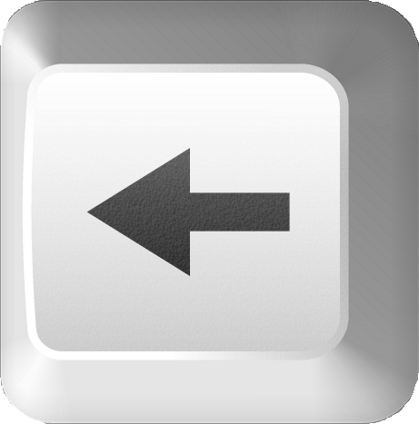

- **Derecha:** Flecha derecha

     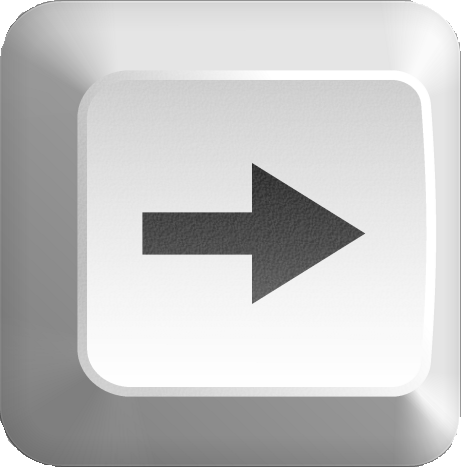

- **Disparar:** Barra espaciadora

     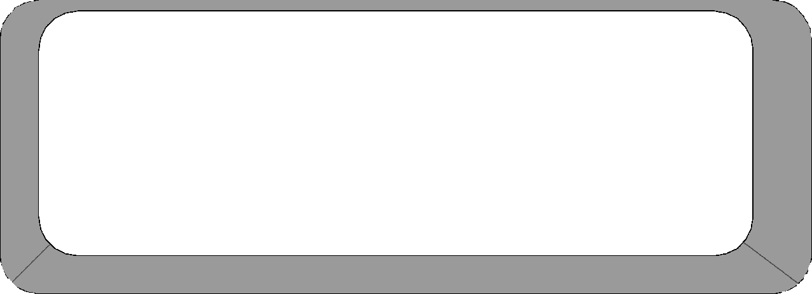

## Características

### DoomSlayer
El **Doom Slayer** es el implacable protagonista de la saga DOOM. Se caracteriza por ser un guerrero endurecido y sin piedad, armado hasta los dientes para enfrentarse a las hordas demoníacas del inframundo. Su habilidad para aniquilar enemigos y su resistencia lo convierten en la última esperanza contra las fuerzas del mal.

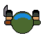
- **Disparar:** El Doom Slayer domina una variedad de armas letales para derrotar a sus enemigos.
- **Caminar:** Navega a través de los niveles del juego, explorando entornos infernales y enfrentándote a desafíos demoníacos.

### Enemigos

El juego presenta una variedad de enemigos demoníacos con comportamientos únicos y desafiantes. Prepárate para enfrentarte a hordas infernales con tácticas diversas.

- **Imp:** Criaturas ágiles y astutas capaces de lanzar proyectiles de fuego.

     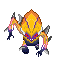

- **Prowler:** Demonios veloces que se desplazan entre las sombras para emboscar a su presa.

     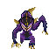
- **Caco Demon:**  Un ser demoníaco flotante con una boca llena de dientes afilados. Su capacidad para volar le otorga una movilidad significativa en el campo de batalla.

     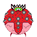

- **Cyberdemon:** Enormes demonios cibernéticos armados con lanzacohetes.

     

- **Pinky:** Bestias blindadas con embestidas poderosas.

     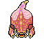

### Armas

Los jugadores pueden elegir entre una amplia gama de **armas** para enfrentarse a los demonios. Desde escopetas hasta lanzallamas, ¡encuentra tu arsenal perfecto para la masacre demoníaca!

- **Fusil:** Cadencia de fuego rápida, buen control de retroceso, adecuado para enfrentamientos tácticos.

     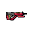
- **Escopeta:** Potente arma de corto alcance para combate cuerpo a cuerpo.
  
    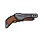
- **MiniGun:** Alta cadencia de fuego, gran capacidad de munición, diseñada para eliminar grandes grupos de enemigos.
  
     
- **Pistola:** Arma estándar para enfrentamientos iniciales.
  
     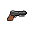
- **Pistola de Plasma:** Dispara proyectiles de energía altamente destructivos.
  
    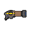

- **BFG9000:** Un cañón masivo que libera explosiones devastadoras.
  
     

### Loot

- **Medkit:** Restaura la salud del Doom Slayer.

    
- **Ammo:** Suministros de munición para recargar armas.

    
- **Armadura:** Proporciona protección adicional contra los ataques enemigos.

    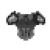
 

### Mapa

Orienta tu camino a través del caos infernal con la ayuda de un detallado **mapa** que te guiará a través de los distintos niveles del juego.

- **Marte**

- **Tierra**
#  

¡Prepárate para la batalla definitiva contra las fuerzas del infierno en **DOOM Arcade**! Escoge sabiamente tus armas, enfréntate a los enemigos con valentía y lucha por tu supervivencia en este emocionante juego inspirado en el clásico DOOM.

*¡Que comience la masacre!*

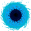
